# TP ADS

## Contents

- [Team](#team)
- [Vision and Scope](#vision-and-scope)
- [Requirements](#requirements)
    - [Use case diagram](#use-case-diagram)
    - [Mockups](#mockups)
    - [User Stories](#user-stories)

## Team
 
- Martim Antunes - 2025191528 - uc2025191528@student.uc.pt
- Bernardo Pedro - 2021231014 - uc2021231014@student.uc.pt
- Daniel Antunes - 2025192233 - daniel.malho.antunes@gmail.com
- Franscisco Tavares - 2020211848 - franciscomcmt@gmail.com
- Gonçalo Gaio - 2022224905 - goncalogaio12@gmail.com

---

## Setup

docker compose up --build 

Open [http://localhost:3000](http://localhost:3000) with your browser to see the result.

You can start editing the page by modifying `app/page.tsx`. The page auto-updates as you edit the file.

## Vision and Scope

#### Problem Statement

##### Project background

Modern streaming platforms and online movie databases offer massive collections of films, but users often struggle to discover content that matches their personal preferences. Without intelligent recommendation systems, users spend excessive time browsing through irrelevant titles. This project aims to create a movie recommendation system that helps users quickly find films aligned with their interests by combining traditional development methods with AI-assisted workflows.

##### Users

- General users interested in discovering and organizing movies to watch;
- Movie enthusiasts who enjoy rating and reviewing films;
- Casual viewers who want quick, personalized recommendations;

---

##### Vision statement

The goal of this project is to build an intuitive and intelligent Movie Recommendation System that allows users to easily discover new movies, rate and receive personalized suggestions.

##### List of features

User Registration and Authentication:

- Create and manage user accounts (sign up, login, logout, change password).

Profile Management;

- View and edit user information.

Movie Catalog Browsing:

- Display paginated lists of movies with key details.

Search and Filter:

- Search by title, director, or genre; filter by rating or year.

Movie Details View:

- Show detailed information about selected movies.

User Ratings:

- Allow users to rate movies (1–5 stars) and update or delete ratings.

Recommendation Engine:

- Suggest movies based on user history and preferences.

- Show “Popular Movies” based on overall ratings.

Watch/Rating History:

- Keep track of movies rated or watched by the user.

My List (Watchlist)

- Allow users to save movies to a personal watchlist for watching later.

- Display saved movies in a dedicated “My List” page.

- Enable adding/removing movies via a heart icon on movie details.

---

## Requirements

### Use Case Diagram

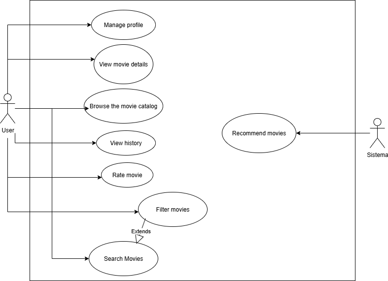

---

### Mockups

### User Storie 1

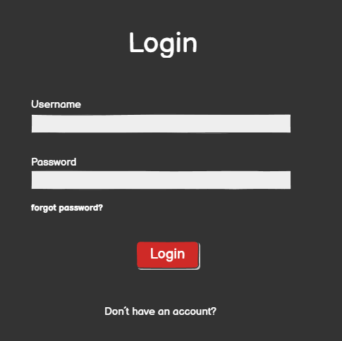

### User Storie 2

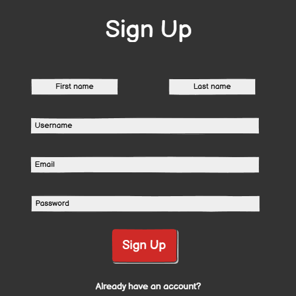

### User Storie 3

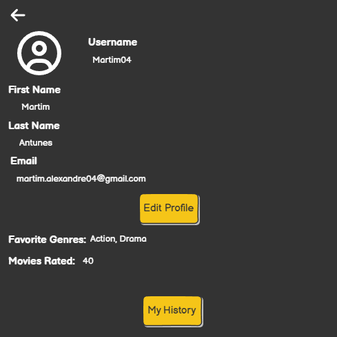

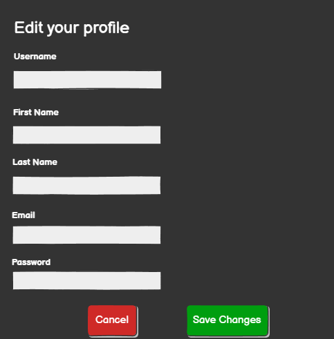

### User Storie 4

### User Storie 5

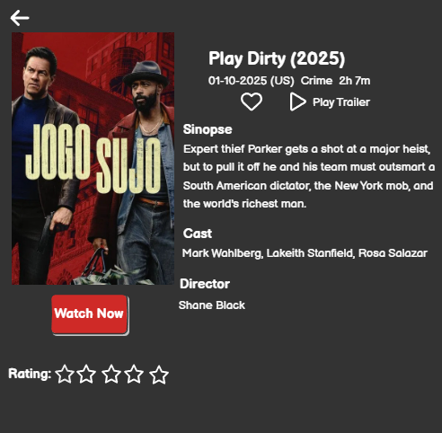

### User Storie 6

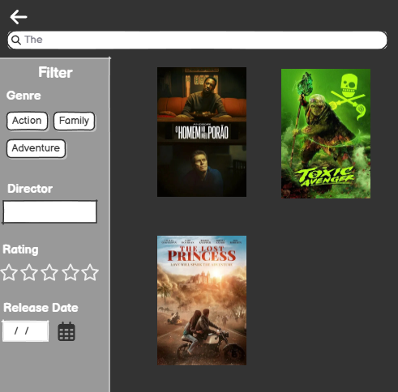

### User Storie 7

### User Storie 8

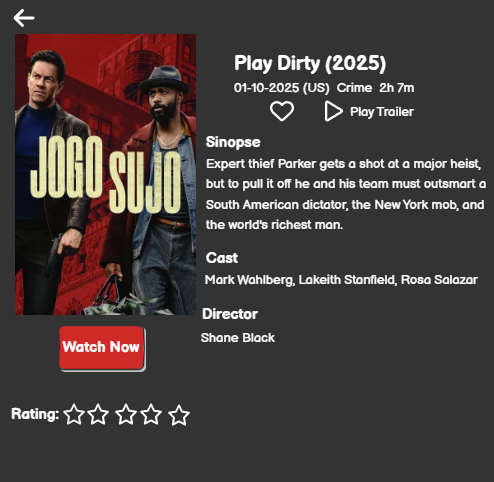

### User Storie 9

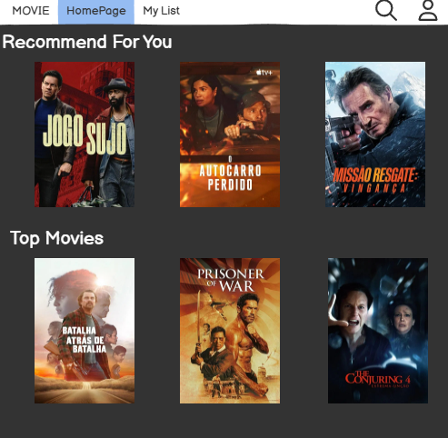

### User Storie 10

### User Storie 11

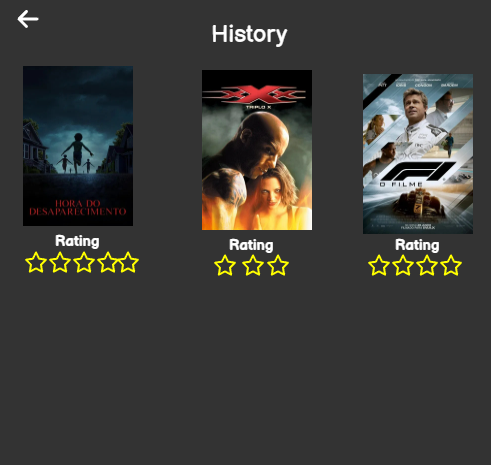

### User Storie 12

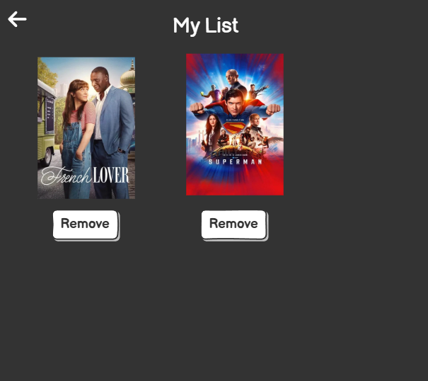

---

### User Stories

- User story 1 (#6)

- User story 2 (#7)

- User story 3 (#8)

- User story 4 (#9)

- User story 5 (#10)

- User story 6 (#11)

- User story 7 (#12)

- User story 8 (#13)

- User story 9 (#14)

- User story 10 (#15)

- User story 11 (#16)

- User story 12 (#17)

---

